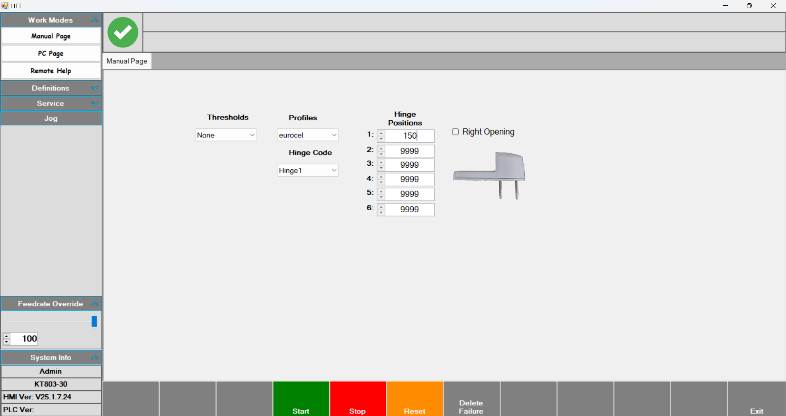
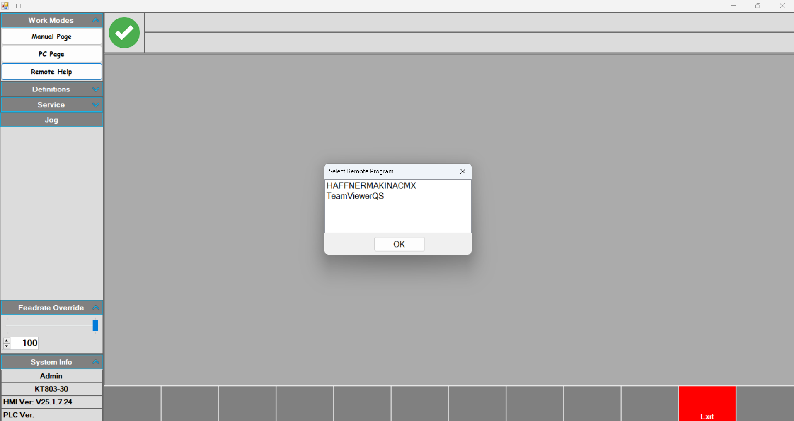
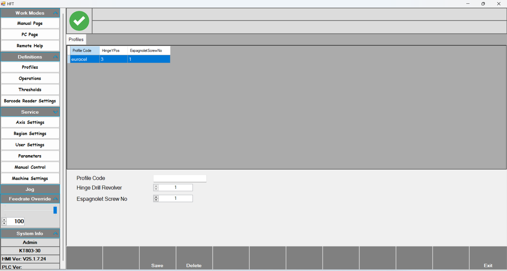
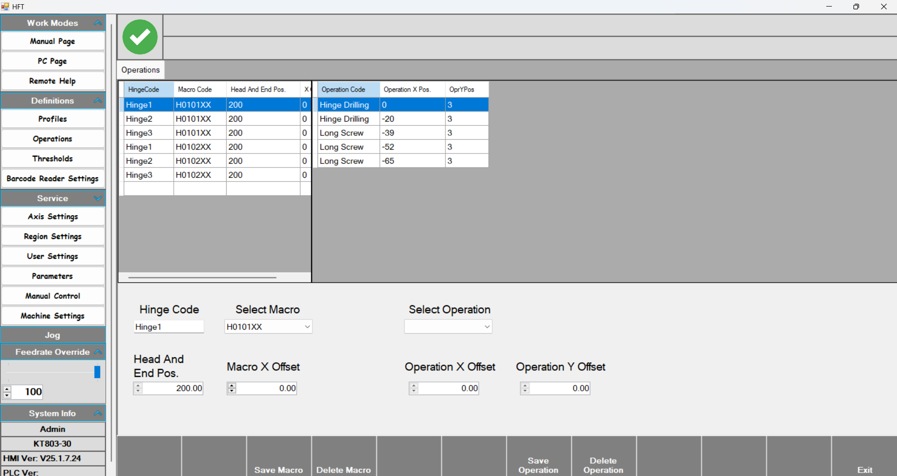
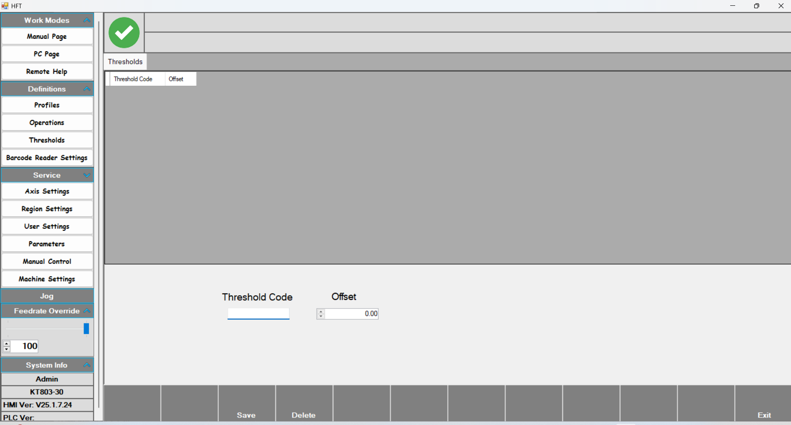
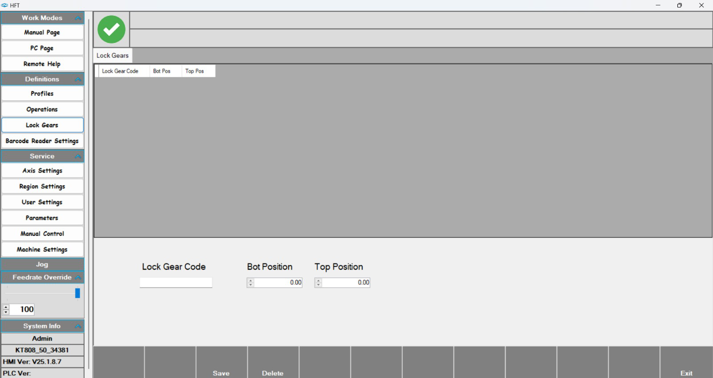
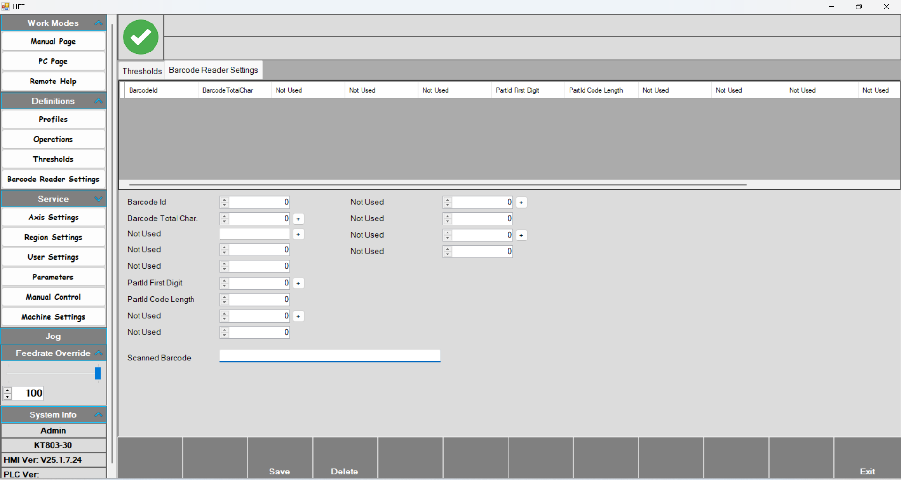
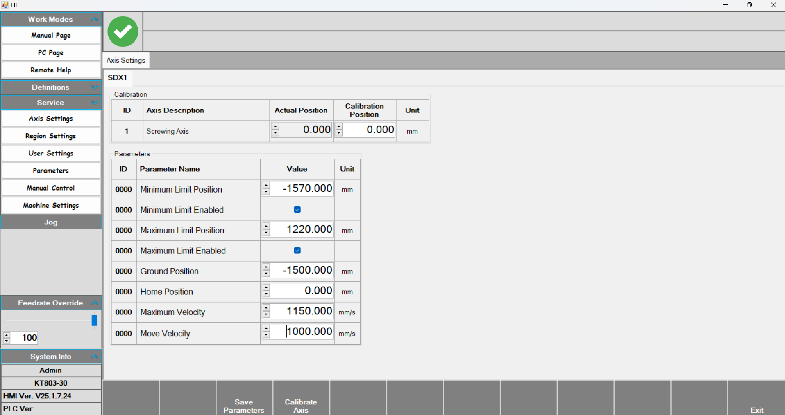
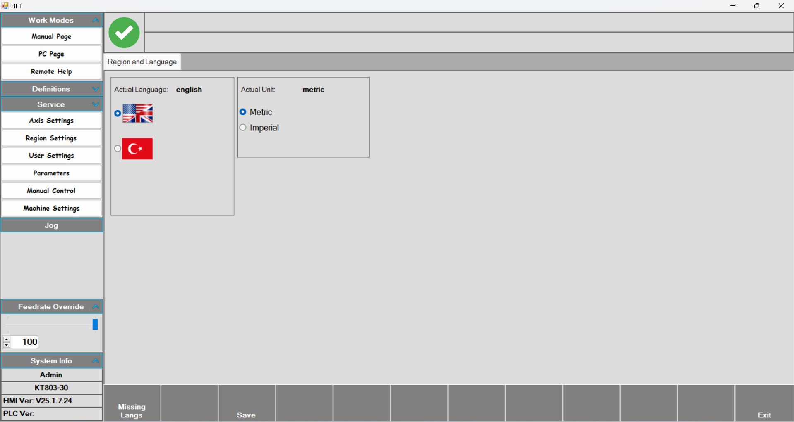

# KT808_50-34381 Manual

 iki motor, iki vidalama, revolver ve X ekseni, profil üzerine menteşe montajı kanat makinası.

## Manuel Work Page

**Manuel Work Page :** Manuel olarak iş yüklenen sayfadır.Profil ve menteşe seçilerek istenen pozisyonda işlem yapılabilir.

- İlk olarak **Thresholds** ve **Profiles** seçimleri yapılır.
- Sonraki adımda **Hinge Code** kısmından tanımlanmış menteşe seçimi yapılır.
- **Hinge Positions** kısmından menteşenin atılması istenilen pozisyon değeri girilir.
- **Right Opening**  kısmında menteşenin sağ ve sol açılım tercihi yapılır.

•Tüm bu parametreler girildikten sonra start verilir ve işlem başlaması için ayak butonuna basılır. İlk basımda profilin dayanacağı ön baskı, ikinci basımda merkezleme baskıları çıkar.Üçünçü kez ayak pedalına basıldığında ise profili önden sabitleyen 3 adet baskı çıkar ve delme işlemini yapacak olan motor Hinge Positions kısmında verilen konuma gider.Delme işlemi tamamlandığında motor grubu sağ tarafta bekler. Operatör delme işlemi yapıldıktan sonra menteşeyi yerine takar ve tekrar ayak pedalına basar. Bu aşamada vidalama işlemi yapılır. Vidalama tamamlandıktan sonra motor grubu grand pozisyona gider ve işlem tamamlanır.

**Kanat makinelerinde ispanyolet**

Sayfanın solunda bulunan Lock Gears bölümünden tanımlanmış gear seçilir. Handle position(kapıda kapı kolunun bulunduğu pozisyon) ve profile length(profil boyu) parametreleri girilir.Bu değerlerden sonra profil seçimi yapılır ve start verilir. Ortada bulunan ayak pedalı ile baskılar çıkar ve son basımda masa eğimli hale gelir. Daha sonra sol pedal ile sol punch kesim yapar. Ortadaki pedala basarak eksen pozisyonlama yapar. Sağ pedal ile sağ punch kesim yapar ve işlem biter.

## Pc Page

**Pc Page :** Operatöre ait çalışma sayfasıdır.

- Bu sayfada start verildikten sonra barcod okutulur. Barcod okunduktan sonra yapılacak işleme ait parametreler boşluklara gelir.Ekranın altında bulunan tabloda okunan işlemler sıralanır.
- Ekranın sol kısmında bulunan **Feedrate Override** kısmından işlem hızı azaltılabilir. 

## Remote Help

**Remote Help:**  Bu sayfa ile yetkili kişilerden destek alabilmek için uzaktan bağlantı yapılır.

## Profiles

**Profiles:** İşlem yapılacak olan profiller tanımlandığı sayfa.

- **Profil Code:** Tanımlanacak profile verilen isim buraya yazılır.
- **Hinge Drill Revolver :** Tool grubunun yapacağı işlemin hangi revolver seviyesinde yapılacağı yazılır.
- **Espagnolet Screw No :** Kt-803 kasa makinalarında ispanyolet bulunmuyor.

## Operations

**Operations:** Kullanılacak menteşe tanımları bu sayfada yapılır.

- **Hinge code** ile menteşeye bir isim verilir. Select macro ile menteşenin sağ açılım ve sol açılım tercihi yapılır. Save macro ile tanımlanan macro kaydedilir, delete macro ile silme işlemi yapılır.
- **Head and end pos :** 
- **Macro 	X offset :** ?
- **Select Operation :** Bu kısımda yapılmak istenen işlem seçilir.Hinge Drilling (sol motor) , Long Screw Drilling (sağ motor), Long screw(sol vidalama) ve Short screw (sağ vidalama) olmak üzere 4 seçenek bulunmaktadır.
- **Operation X offset** ile delme ve vidalama işlemlerinin yeri belirlenir.Bu aşamada menteşe üzerinden ölçüler girilir. İlk delme işlemi 0 olarak kabul edilir ve menteşe üzerinden kumpas yardımıyla alınan ölçüler bu sıfıra göre yazılır.
- **Operaiton Y offset** ile işlem yapılacak revolver değeri belirlenir.

## Thresholds

Bu sayfa sadece kasa makinalarında bulunmaktadır.

## Lock Gear 

Bu sayfa sadece kanat makinalarında bulunmaktadır. İspanyolet ile ilgili bir sayfadır.

## Barcode Reader Settings

## Axis Settings

**AXİS SETTTİNGS:** SDX1 ekseni bu sayfada bulunan parametreler ile kalibre edilir.

- Calibration tablosunda **calibration position** değeri girilerek eksen kalibre edilir.**Actual position** ile anlık pozisyon değeri görüntülenir.
- **Minimum Limit position :** Eksenin gidebileceği minimum değer.
- **Minimum Limit Enabled :** Eksenin gidebileceği minimum değeri aktifleştirir.
- **Maximum Limit position :** Eksenin gidebileceği maximum değer.
- **Maximum Limit Enabled :** Eksenin gidebileceği maximum değeri aktifleştirir.
- **Ground position :** İşlem başlamadan önce ve bittikten sonra tool grubunun gidip beklediği pozisyon.
- **Maximum Velocity :** Eksenin ulaşabileceği maksimum hız değeri.
- **Move Velocity :** Eksenin gidebileceği minimum hız değeri.

## Region and Language

**Region and Language :** İstenilen dil veya ölçü birimi seçildikten sonra Save butonuna basılır ve yapılan değişiklikler kaydedilmiş olur.

## User Settings

## Manuel Control

**Manual Control :** Activate butonuna basıldıktan sonra istenilen çıkışa basarak aktif edilir. Tekrar basarak eski konumuna getirilir.

## Parameters

- **Parameters:** Bu sayfada tool grubunda bulun motor ve vidalama gruplarına ait ofsett değerleri bulunmaktadır.
- **Left Drill Offset:** Tool grubunun ilk motorudur. En solda olduğu için bu motor sıfır olarak alınır.
- **Left-Rigt Drill Distance :** İki motor arasındaki mesafedir.
- **Left-Head Screw – Left Drill Distance :** İlk motor ve ilk vidalama grubu arasındaki mesafedir.
- **Right Head Screw-Left Drill Distance :** İlk motor ve ikinci vidalama grubu arasındaki mesafedir. 

## Revolver

- Manual control sayfasında revolver seviyesinin ayarlandığı kısımdır. Set Pos parametresine istenilen değer girilir ve set butonuna basılır. Daha sonra revolver istenilen seviyeye gelir.Anlık revolver seviyesini Act.Pos değeri ile görülür.

## Machine Settings

